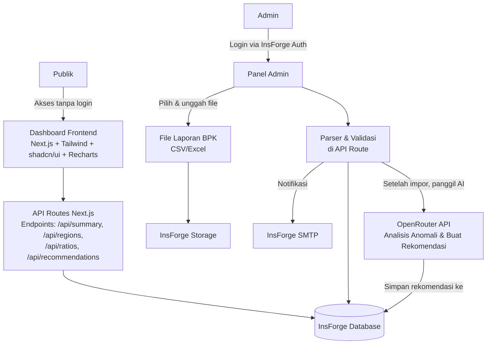
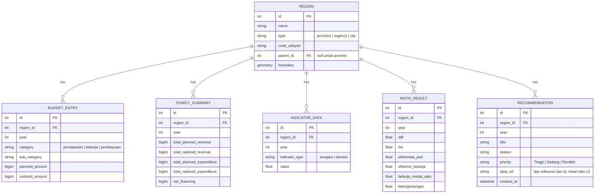

# PRD — Dashboard Laporan Keuangan Pemda Provinsi NTB

## 1. Overview
**Masalah yang diselesaikan**
Akses publik terhadap data keuangan pemerintah daerah (APBD) di Provinsi Nusa Tenggara Barat (NTB) seringkali sulit, tersebar, dan tidak mudah dipahami oleh warga biasa. Masyarakat, jurnalis, dan pemangku kepentingan membutuhkan satu tempat transparan yang menyajikan ringkasan pendapatan, belanja, pembiayaan, realisasi versus anggaran, tren tahunan, serta perbandingan antar kabupaten/kota secara visual. Selain itu, belum ada alat yang membantu auditor atau pengawas (BPK, Inspektorat, DPRD) untuk mengidentifikasi area‑area yang perlu diperiksa lebih dalam berdasarkan pola‑pola mencurigakan dari laporan keuangan yang sudah diaudit.

**Tujuan utama**
Membangun dashboard web interaktif yang merangkum laporan keuangan seluruh pemerintah daerah di NTB (1 provinsi + 10 kabupaten/kota). Seluruh data berasal dari laporan **yang telah diaudit oleh BPK**, diunggah manual oleh admin terpercaya. Dashboard menampilkan visualisasi menarik dengan palet hijau‑emas khas NTB. **Fitur baru** yang ditambahkan adalah:
- **Analisis Rasio Kinerja Keuangan** — perbandingan rasio‑rasio penting (kemandirian fiskal, efektivitas, dll.) antar seluruh daerah.
- **Rekomendasi Pemeriksaan Selanjutnya (berbasis AI)** — sistem secara otomatis menganalisis anomali atau tanda‑tanda yang perlu ditelusuri (misalnya serapan rendah, lonjakan belanja, rasio “Perlu Perhatian”) dan menghasilkan daftar area fokus audit untuk tiap daerah. Fitur ini memberi nilai tambah bagi pengawas keuangan dan siapa saja yang ingin menggali lebih dalam.

## 2. Requirements
- **Publik tanpa login** – seluruh konten (termasuk rekomendasi) dapat diakses tanpa registrasi; panel admin terpisah untuk pembaruan data.
- **Responsif & modern** – tampilan optimal di ponsel, tablet, dan desktop; mengacu pada palet khas NTB:
  - `#1B6744` – hijau tua (warna utama)
  - `#289865` – hijau aksen
  - `#B0D4BF` – hijau muda (latar belakang sekunder)
  - `#7A631A` – emas tua
  - `#D4AF37` – emas aksen
  - `#E9D69B` – emas muda (highlight, border)
- **Sumber data** – hanya laporan APBD hasil audit BPK (file CSV/Excel) yang diunggah admin melalui panel aman. Tidak ada penarikan otomatis dari sumber eksternal.
- **Performa** – halaman dimuat dalam < 3 detik pada koneksi biasa; hasil rekomendasi tersimpan di database sehingga tidak perlu dihitung ulang tiap permintaan.
- **Visualisasi** – mencakup: kartu indikator utama (KPI), grafik batang, grafik garis tren, grafik donat, peta interaktif, tabel peringkat, radar chart (untuk rasio), serta **tampilan kartu rekomendasi**.
- **Ekspor** – unduh ringkasan dalam PDF atau CSV.
- **Keamanan panel admin** – autentikasi dengan InsForge Auth.
- **Pembaruan rekomendasi** – rekomendasi otomatis dibuat ulang setiap kali data baru diimpor untuk tahun/daerah terkait.

## 3. Core Features
- **Ringkasan APBD provinsi** – total pendapatan, belanja, pembiayaan, dan persentase realisasi vs anggaran.
- **Kartu KPI per daerah** – ringkasan keuangan tiap kabupaten/kota.
- **Grafik perbandingan** – diagram batang yang membandingkan pendapatan, belanja, pembiayaan antar seluruh daerah.
- **Grafik tren** – garis realisasi tahunan untuk satu daerah atau provinsi.
- **Peta interaktif NTB** – warna berdasarkan level serapan; klik untuk detail.
- **Tabel peringkat** – urutkan berdasarkan total realisasi, persentase serapan, dll.
- **Filter dinamis** – pilih tahun, jenis komponen, satuan (juta/milyar).
- **Halaman detail daerah** – rincian pendapatan asli daerah, dana perimbangan, belanja pegawai, belanja modal, proporsi grafik donat.
- **Analisis Rasio Kinerja Keuangan**
  - Tabel perbandingan enam rasio utama: Derajat Desentralisasi Fiskal, Rasio Kemandirian, Efektivitas PAD, Efisiensi Belanja, Belanja Modal/Total Belanja, Ketergantungan.
  - Radar chart interaktif untuk membandingkan profil rasio antar daerah terpilih.
  - Label otomatis “Baik”, “Cukup”, “Perlu Perhatian” berdasarkan ambang batas.
- **Rekomendasi Pemeriksaan Selanjutnya (AI‑powered)**
  - Setelah data diimpor, sistem memanggil **OpenRouter API** untuk menganalisis pola anomali (misal: serapan <30% atau >98% di akhir tahun, rasio berstatus “Perlu Perhatian”, penurunan PAD >25% dibanding tahun lalu, lonjakan belanja pos tertentu tanpa penjelasan).
  - Hasil analisis berupa daftar rekomendasi per daerah. Setiap rekomendasi memiliki:
    - **Judul area** (contoh: “Periksa realisasi Belanja Modal Dinas PUPR”)
    - **Alasan singkat** (contoh: “Realisasi 98% terkonsentrasi di triwulan IV, sedangkan serapan di tiga triwulan pertama sangat rendah.”)
    - **Tingkat prioritas** (Tinggi, Sedang, Rendah) yang ditentukan AI berdasarkan bobot anomali.
    - **Tautan ke data terkait** – mengarahkan pengguna ke grafik atau tabel yang mendukung temuan tersebut.
  - Rekomendasi disimpan di database, dapat diakses publik melalui halaman khusus “Rekomendasi Pemeriksaan” yang bisa difilter per daerah dan tahun.
  - Admin dapat memicu ulang analisis jika diperlukan.
- **Ekspor data** – unduh PDF/CSV untuk data yang sedang ditampilkan, termasuk daftar rekomendasi.
- **Mode gelap** (opsional).

## 4. User Flow

### Publik (pengunjung dashboard)
1. **Beranda** – tiba di halaman utama, lihat ringkasan provinsi, peta, dan tiga kartu KPI utama.
2. **Pilih tahun** – ubah tahun anggaran, semua data diperbarui.
3. **Jelajahi peta** – arahkan kursor ke daerah, klik untuk menuju halaman detail.
4. **Halaman detail daerah** – tampilkan KPI, grafik batang/donat, tren tahunan, dan tabel rincian.
5. **Analisis Rasio Kinerja** – dari menu “Rasio Kinerja”, pilih tahun dan beberapa daerah. Halaman menampilkan:
   - Tabel perbandingan rasio.
   - Radar chart interaktif.
   - Label interpretasi di bawah setiap nilai.
6. **Lihat Rekomendasi Pemeriksaan** – dari menu “Rekomendasi” (atau tombol di halaman detail daerah), pengguna memilih daerah dan tahun. Sistem menampilkan daftar kartu rekomendasi, masing‑masing dengan judul, alasan, prioritas, dan tautan ke data sumber. Kartu berwarna sesuai prioritas (merah‑hijau‑kuning).
7. **Perbandingan antar daerah** – pilih dua atau lebih daerah, lihat grafik berdampingan atau tabel peringkat.
8. **Unduh** – di setiap halaman, tombol ekspor menghasilkan PDF (untuk tampilan grafis/daftar rekomendasi) atau CSV (untuk tabel).

### Admin (panel internal)
- **Login aman** – akses `/admin` dengan InsForge Auth.
- **Unggah laporan BPK** – pilih tahun, daerah, unggah file CSV/Excel.
- **Pratinjau & validasi** – sistem menampilkan ringkasan data, periksa konsistensi.
- **Impor** – setelah dikonfirmasi, parser mengurai data, menyimpan ke `BUDGET_ENTRY`, memperbarui `YEARLY_SUMMARY`, menghitung ulang `RATIO_RESULT`, dan **memanggil OpenRouter API** untuk menghasilkan rekomendasi baru yang disimpan di `RECOMMENDATION`.
- **Pantau hasil** – admin melihat daftar unggahan, status impor, dan notifikasi (melalui InsForge SMTP) jika terjadi kesalahan atau saat rekomendasi baru telah dibuat.

## 5. Architecture
Aplikasi Next.js dengan panel admin terpisah. Backend sepenuhnya dikelola oleh InsForge. Fitur AI menggunakan OpenRouter API untuk menghasilkan rekomendasi pemeriksaan setelah data baru diimpor.

Penjelasan:
- Publik membaca data dan rekomendasi melalui API routes yang mengakses database.
- Admin mengunggah laporan, file disimpan di InsForge Storage. Parser memproses dan menyimpan data ke InsForge Database.
- Setelah penyimpanan berhasil, sistem otomatis memanggil OpenRouter API dengan data ringkasan daerah (serapan, rasio, deviasi) untuk menghasilkan rekomendasi. Hasilnya disimpan di tabel `RECOMMENDATION`.
- InsForge SMTP mengirim notifikasi bila ada kesalahan impor.
- Dengan demikian, rekomendasi selalu tersedia langsung tanpa menunggu permintaan pengguna.

## 6. Database Schema
Skema diperluas dengan tabel `RECOMMENDATION` untuk menyimpan hasil analisis AI.

**Penjelasan tabel**
- `REGION` – data provinsi dan kabupaten/kota.
- `BUDGET_ENTRY` – catatan detail per pos anggaran dari laporan BPK.
- `YEARLY_SUMMARY` – agregat tahunan untuk mempercepat kueri.
- `INDICATOR_DATA` – nilai indikator seperti persentase serapan.
- `RATIO_RESULT` – enam rasio kinerja keuangan per daerah per tahun.
- `RECOMMENDATION` – menyimpan hasil rekomendasi AI:
  - `title`: ringkasan area yang disarankan untuk diperiksa.
  - `reason`: alasan singkat (maksud dari anomali).
  - `priority`: Tinggi, Sedang, atau Rendah berdasarkan tingkat urgensi anomali.
  - `data_ref`: teks yang menunjukkan data sumber (contoh: `ratio:efektivitas_pad` atau `budget_entry:231`), digunakan untuk membuat tautan otomatis ke grafik/tabel.
  - `created_at`: waktu pembuatan, memudahkan admin mengetahui kapan analisis terakhir dilakukan.

## 7. Tech Stack
- **Framework**: Next.js (App Router) – rendering hybrid (SSG/SSR).
- **Backend & Deployment**: InsForge – mengelola server, database, penyimpanan file, dan hosting otomatis.
- **Authentication**: InsForge Auth – untuk panel admin.
- **Email Service**: InsForge SMTP – notifikasi ke admin.
- **Desain & UI**: Tailwind CSS + shadcn/ui – dengan palet hijau‑emas NTB.
- **AI Integration**: OpenRouter API – untuk menghasilkan rekomendasi pemeriksaan otomatis.
- **Pustaka grafik**: Recharts – grafik batang, garis, donat, dan radar chart.
- **Peta interaktif**: Leaflet + react-leaflet.
- **Parsing file**: xlsx (SheetJS) atau csv-parse.
- **Ekspor publik**: jsPDF + jspdf-autotable (PDF), PapaParse (CSV).